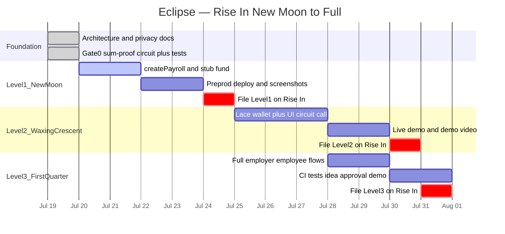

# Eclipse

Private payroll on [Midnight](https://midnight.network). An employer deposits a fixed pool of tokens and distributes it across a known set of recipients with individually private amounts — a zero-knowledge proof guarantees the hidden amounts sum exactly to the public deposit, so anyone can verify the books balance without anyone, including the chain itself, ever learning who received what.

Built for Rise In's [New Moon to Full: Monthly Moonshots on Midnight](https://www.risein.com/programs/new-moon-to-full-monthly-moonshots-on-midnight) program — Level 3 idea list, *Private Payroll / Splits*.

## Status

Gate 0 complete: `distribute()` sum-proof compiles and invariant tests pass (`contracts/`). Next: Level 1 — `createPayroll` + stub `fund`, Preprod deploy, and submission packaging. No live demo or deploy address yet.

**Last updated:** 2026-07-19 · Program window: 2026-06-29 → 2026-07-31

### Progress (Gantt)



| Gate / level | State |
|---|---|
| Gate 0 — sum-proof spike | **Done** |
| Level 1 — New Moon (deploy + README evidence) | **In progress** |
| Level 2 — Waxing Crescent (Lace + UI) | Planned |
| Level 3 — First Quarter (full dApp + CI) | Planned |

Sequencing rules: [docs/boundaries.md](docs/boundaries.md).

## Initial idea

Eclipse is a private payroll dApp on Midnight. An employer deposits a fixed pool of test tokens, assigns each recipient's share privately, and distributes in one atomic transaction. A zero-knowledge proof guarantees the hidden amounts sum exactly to the public deposit — so recipients and observers can trust the books balance without anyone (including the chain itself) ever seeing who earned what. Salary privacy is a real-world norm; Eclipse makes it a verifiable one.

## Public state vs private witness

In Compact, circuit inputs are **private by default**. Data becomes public when it is written to the ledger (or returned / passed cross-contract) — not merely because `disclose()` appears in source.

| Public (ledger) | Private (witnesses) |
|---|---|
| Employer, recipient addresses, `depositTotal` | Per-recipient `amounts` |
| `status` (`Created` → `Funded` → `Distributed`) | Per-recipient `salts` |
| `receiptCommitments` (opaque hashes) | Anything not written to ledger |

`distribute()` asserts `sum(amounts) == depositTotal` without putting individual amounts on-chain. Full disclosure ledger: [docs/privacy-model.md](docs/privacy-model.md).

## Quick Start

```bash
# Node 22 (see .nvmrc)
npm install

# Compile the Compact contract (requires Compact CLI)
cd contracts && npm run compile

# Run Gate 0 invariant tests
npm test
```

Proof server (needed later for full proving / deploy flows):

```bash
docker run -p 6300:6300 midnightntwrk/proof-server:latest midnight-proof-server -v
```

## Architecture

One Compact contract (create / fund / distribute / claim — Gate 0 ships helpers + `distribute`; L1 adds create + stub fund), one React frontend with employer / recipient views, and an SDK adapter layer isolating Midnight.js and Lace. Circuits run locally; only proofs and signed transactions reach the network.

Details: [docs/architecture.md](docs/architecture.md). Scope gates: [docs/boundaries.md](docs/boundaries.md).

## Privacy Model

Deposit total, recipient list, and distribution success (`status = Distributed` + commitments) are public. Individual amounts never appear as plaintext ledger state — including for the employer via chain queries. See [docs/privacy-model.md](docs/privacy-model.md).

## Testing

```bash
cd contracts && npm test
```

Current coverage: `distribute_accepts_when_sum_equals_total`, `distribute_rejects_when_sum_exceeds_total`.

## Documentation

| Doc | Contents |
|---|---|
| [docs/README.md](docs/README.md) | Docs index |
| [docs/architecture.md](docs/architecture.md) | System design |
| [docs/privacy-model.md](docs/privacy-model.md) | Who learns what |
| [docs/boundaries.md](docs/boundaries.md) | Scope and gates |

## License

MIT
