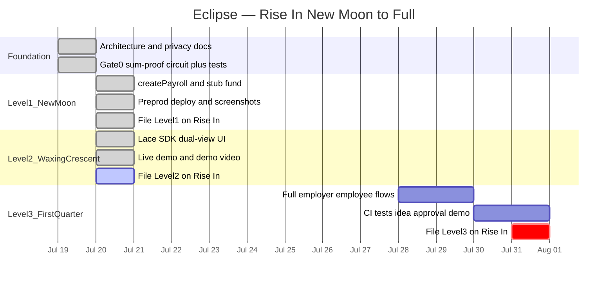

# Eclipse

Private payroll on [Midnight](https://midnight.network). An employer deposits a fixed pool of tokens and distributes it across a known set of recipients with individually private amounts — a zero-knowledge proof guarantees the hidden amounts sum exactly to the public deposit, so anyone can verify the books balance without anyone, including the chain itself, ever learning who received what.

Built for Rise In's [New Moon to Full: Monthly Moonshots on Midnight](https://www.risein.com/programs/new-moon-to-full-monthly-moonshots-on-midnight) program — Level 3 idea list, *Private Payroll / Splits*.

## Status

Level 2 Waxing Crescent **ready to file**: Lace-connected dual-view UI (employer wizard + observer ledger), hardened SDK adapters (`Result` boundary), privacy wipe tests, and Preprod contract from L1. Live demo on Netlify; full distribute needs a local proof-server (honest — same class as Midnight hello-world docs).

**Last updated:** 2026-07-20 · Program window: 2026-06-29 → 2026-07-31

### Live demo

| Surface | URL |
|---|---|
| Employer wizard | [https://eclipse-private-payroll.netlify.app/employer](https://eclipse-private-payroll.netlify.app/employer) |
| Observer ledger | [https://eclipse-private-payroll.netlify.app/observer](https://eclipse-private-payroll.netlify.app/observer) |

Connect-only works on the hosted site without a proof-server. Create → fund → distribute needs Lace (Preprod) plus a local proof-server on `127.0.0.1:6300`.

### Contract address

| Network | Address |
|---|---|
| Preview | — |
| Preprod | [`3aec836e6c723531cb13803e63795d531117c73231fa7793372c504a8bfa3d47`](https://explorer.1am.xyz/contract/3aec836e6c723531cb13803e63795d531117c73231fa7793372c504a8bfa3d47?network=preprod) |

**Evidence:** [L1 compile](docs/evidence/l1-compile.png) · [L1 deploy](docs/evidence/l1-deploy.png) · [L2 connect](docs/evidence/l2-connect.png) · [L2 distribute](docs/evidence/l2-distribute.png) · [L2 observer](docs/evidence/l2-observer.png) · [L2 demo video](docs/evidence/l2-demo.webm) · [storyboard](docs/evidence/l2-demo-storyboard.md)

### Progress (Gantt)



| Gate / level | State |
|---|---|
| Gate 0 — sum-proof spike | **Done** |
| Level 1 — New Moon | **Filed** (Rise In) |
| Level 2 — Waxing Crescent (Lace + dual-view) | **Ready to file** (Rise In) |
| Level 3 — First Quarter (full dApp + CI) | Planned |

Sequencing rules: [docs/boundaries.md](docs/boundaries.md). Level filing playbooks: [docs/submission.md](docs/submission.md).

## Initial idea

Eclipse is a private payroll dApp on Midnight. An employer deposits a fixed pool of test tokens, assigns each recipient's share privately, and distributes in one atomic transaction. A zero-knowledge proof guarantees the hidden amounts sum exactly to the public deposit — so recipients and observers can trust the books balance without anyone (including the chain itself) ever seeing who earned what. Salary privacy is a real-world norm; Eclipse makes it a verifiable one.

## Privacy claim (L2)

Individual payroll amounts are **private witnesses**. Observers (and the chain) see employer, recipient addresses, `depositTotal`, `status`, and opaque `receiptCommitments` — never plaintext per-recipient amounts. The employer UI clears amounts from memory and the DOM after a successful distribute; the `/observer` route has no amount inputs. Disclosure ledger: [docs/privacy-model.md](docs/privacy-model.md).

## Public state vs private witness

In Compact, circuit inputs are **private by default**. Data becomes public when it is written to the ledger (or returned / passed cross-contract) — not merely because `disclose()` appears in source.

| Public (ledger) | Private (witnesses) |
|---|---|
| Employer, recipient addresses, `depositTotal` | Per-recipient `amounts` |
| `status` (`Created` → `Funded` → `Distributed`) | Per-recipient `salts` |
| `receiptCommitments` (opaque hashes) | Anything not written to ledger |

`distribute()` asserts `sum(amounts) == depositTotal` without putting individual amounts on-chain.

## Quick Start

```bash
# Node 22 (see .nvmrc)
npm install

# Compile the Compact contract (requires Compact CLI)
cd contracts && npm run compile

# Contract + SDK + web privacy tests
npm test
```

### Web UI (local)

```bash
# Terminal A — proof server (required for create/fund/distribute)
docker run -p 6300:6300 midnightntwrk/proof-server:latest midnight-proof-server -v

# Terminal B — dual-view app
npm run dev -w @eclipse/web
# open http://127.0.0.1:5173/employer and /observer
```

Needs Lace (Preprod) + funded tDUST for a real wallet connect. Connect-only works without the proof-server; circuits call `ProofClient.healthCheck()` first and fail closed if `:6300` is down.

### Deploy contract (Preprod)

```bash
cd contracts && MIDNIGHT_NETWORK=preprod npm run deploy
```

## Live demo prerequisites

Judges on Netlify **cannot** use your laptop’s proof-server unless they run one locally.

1. Install [Lace](https://www.lace.io/) and switch to **Preprod**
2. Fund tDUST via the Midnight faucet
3. Run the proof-server on loopback:

```bash
docker run -p 6300:6300 midnightntwrk/proof-server:latest midnight-proof-server -v
```

4. Open the live demo → Connect Lace → Employer create → stub fund → distribute
5. Open `/observer` (second tab): public status + commitments; **no** private amounts

The browser UI uses the SDK’s in-memory circuit transport for the L2 privacy demo (same public field shapes as the Compact ledger). On-chain Preprod address above remains the L1 deploy evidence; wiring a full Midnight.js browser provider is post-L2.

## Architecture

Monorepo: `apps/web` → `packages/sdk` → Lace / proof-server. The web app never imports Midnight.js. SDK ports (`WalletPort`, `EclipsePort`) return typed `Result`; adapters (`LaceAdapter`, `MidnightAdapter`, `ProofClient`) are the only external-touch files.

Details: [docs/architecture.md](docs/architecture.md). Scope gates: [docs/boundaries.md](docs/boundaries.md).

## Privacy Model

Deposit total, recipient list, and distribution success (`status = Distributed` + commitments) are public. Individual amounts never appear as plaintext ledger state. Detail: [docs/privacy-model.md](docs/privacy-model.md).

## Testing

```bash
npm test
```

- **contracts** — 5 tests: sum-proof + lifecycle
- **@eclipse/sdk** — Result mapping, salts, ProofClient loopback, mock-port adapters
- **@eclipse/web** — amount wipe after distribute, observer has no private amount fields, `MAX_RECIPIENTS` validation

## Documentation

| Doc | Contents |
|---|---|
| [docs/README.md](docs/README.md) | Docs index |
| [docs/submission.md](docs/submission.md) | Rise In submission playbook |
| [docs/architecture.md](docs/architecture.md) | System design |
| [docs/privacy-model.md](docs/privacy-model.md) | Who learns what |
| [docs/boundaries.md](docs/boundaries.md) | Scope and gates |

## License

MIT
