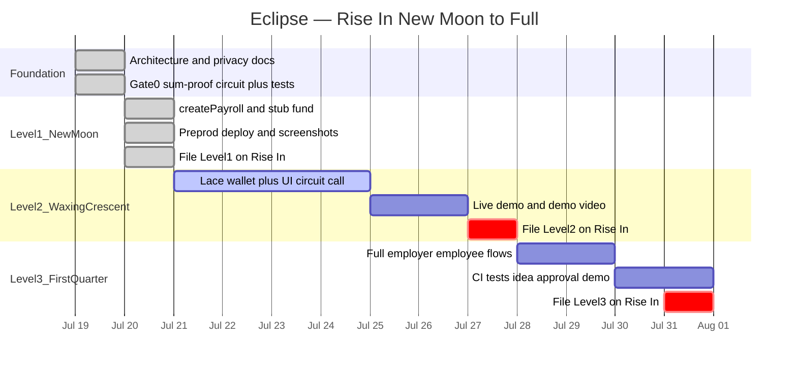

# Eclipse

Private payroll on [Midnight](https://midnight.network). An employer deposits a fixed pool of tokens and distributes it across a known set of recipients with individually private amounts — a zero-knowledge proof guarantees the hidden amounts sum exactly to the public deposit, so anyone can verify the books balance without anyone, including the chain itself, ever learning who received what.

Built for Rise In's [New Moon to Full: Monthly Moonshots on Midnight](https://www.risein.com/programs/new-moon-to-full-monthly-moonshots-on-midnight) program — Level 3 idea list, *Private Payroll / Splits*.

## Status

Level 1 New Moon **filed** on Rise In (2026-07-20): Eclipse with `createPayroll` + stub `fund` + `distribute` compiles, tests green, and is deployed on Preprod. Next: Level 2 (Lace + UI circuit call).

**Last updated:** 2026-07-20 · Program window: 2026-06-29 → 2026-07-31

### Contract address

| Network | Address |
|---|---|
| Preview | — |
| Preprod | [`3aec836e6c723531cb13803e63795d531117c73231fa7793372c504a8bfa3d47`](https://explorer.1am.xyz/contract/3aec836e6c723531cb13803e63795d531117c73231fa7793372c504a8bfa3d47?network=preprod) |

**Evidence:** [compile](docs/evidence/l1-compile.png) · [deploy](docs/evidence/l1-deploy.png) · [address file](docs/evidence/l1-deploy-address-preprod.txt) · [faucet](docs/evidence/)

### Progress (Gantt)



| Gate / level | State |
|---|---|
| Gate 0 — sum-proof spike | **Done** |
| Level 1 — New Moon | **Filed** (Rise In) |
| Level 2 — Waxing Crescent (Lace + UI) | Next |
| Level 3 — First Quarter (full dApp + CI) | Planned |

Sequencing rules: [docs/boundaries.md](docs/boundaries.md). Level filing playbooks: [docs/submission.md](docs/submission.md).

## Initial idea

Eclipse is a private payroll dApp on Midnight. An employer deposits a fixed pool of test tokens, assigns each recipient's share privately, and distributes in one atomic transaction. A zero-knowledge proof guarantees the hidden amounts sum exactly to the public deposit — so recipients and observers can trust the books balance without anyone (including the chain itself) ever seeing who earned what. Salary privacy is a real-world norm; Eclipse makes it a verifiable one.

## Public state vs private witness

In Compact, circuit inputs are **private by default**. Data becomes public when it is written to the ledger (or returned / passed cross-contract) — not merely because `disclose()` appears in source.

| Public (ledger) | Private (witnesses) |
|---|---|
| Employer, recipient addresses, `depositTotal` | Per-recipient `amounts` |
| `status` (`Created` → `Funded` → `Distributed`) | Per-recipient `salts` |
| `receiptCommitments` (opaque hashes) | Anything not written to ledger |

`distribute()` asserts `sum(amounts) == depositTotal` without putting individual amounts on-chain. Full disclosure ledger: [docs/privacy-model.md](docs/privacy-model.md).

## Quick Start

```bash
# Node 22 (see .nvmrc)
npm install

# Compile the Compact contract (requires Compact CLI)
cd contracts && npm run compile

# Lifecycle + sum-proof tests
npm test
```

Proof server (required for deploy / proving):

```bash
docker run -p 6300:6300 midnightntwrk/proof-server:latest midnight-proof-server -v
```

Deploy to Preprod (funded wallet seed in `.env.preprod` — see `.env.preprod.example`):

```bash
cd contracts && MIDNIGHT_NETWORK=preprod npm run deploy
```

## Architecture

One Compact contract today (`createPayroll`, stub `fund`, `distribute`). Planned next: Lace-connected React UI and SDK adapters (`WalletPort` / `EclipsePort`); `claim` post-L1. Circuits run locally; only proofs and signed transactions reach the network.

Details: [docs/architecture.md](docs/architecture.md). Scope gates: [docs/boundaries.md](docs/boundaries.md).

## Privacy Model

Deposit total, recipient list, and distribution success (`status = Distributed` + commitments) are public. Individual amounts never appear as plaintext ledger state. Detail: [docs/privacy-model.md](docs/privacy-model.md) (same disclosure rules as the table above).

## Testing

```bash
cd contracts && npm test
```

Five tests: sum-proof pass/reject plus lifecycle (create→fund→distribute, reject before fund, reject double-distribute).

## Documentation

| Doc | Contents |
|---|---|
| [docs/README.md](docs/README.md) | Docs index |
| [docs/submission.md](docs/submission.md) | Rise In submission playbook |
| [docs/architecture.md](docs/architecture.md) | System design |
| [docs/privacy-model.md](docs/privacy-model.md) | Who learns what |
| [docs/boundaries.md](docs/boundaries.md) | Scope and gates |

## License

MIT
