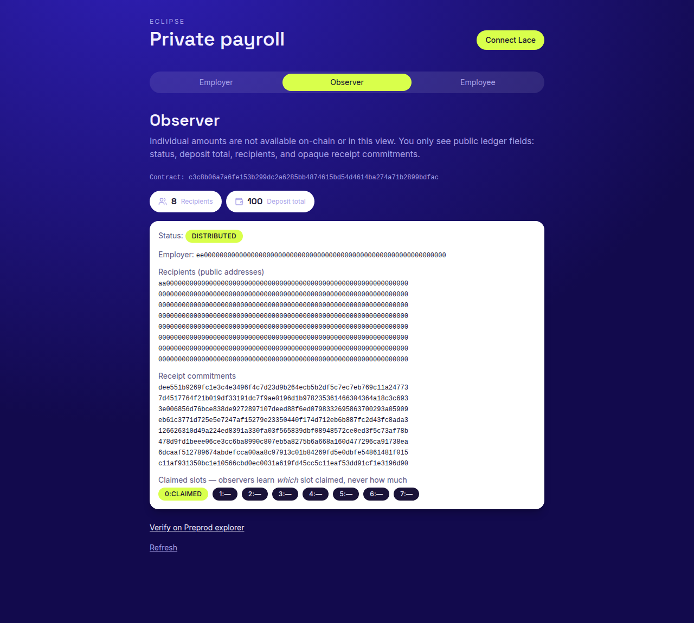
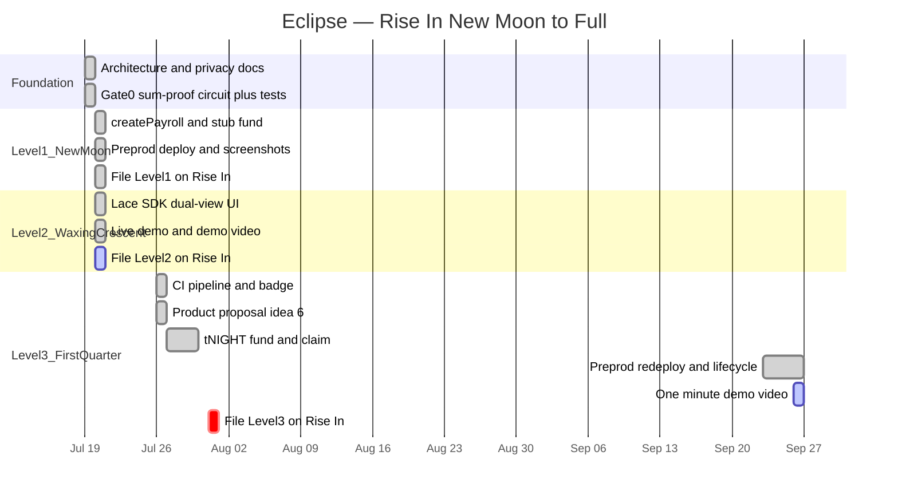
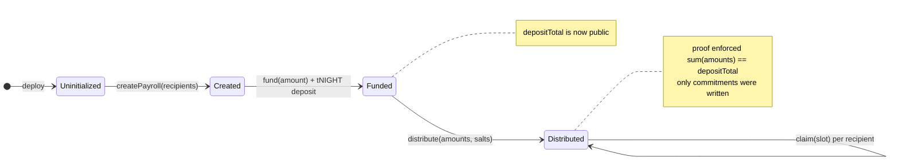
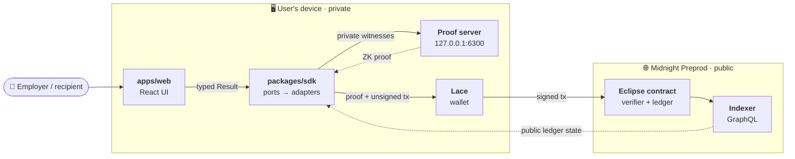
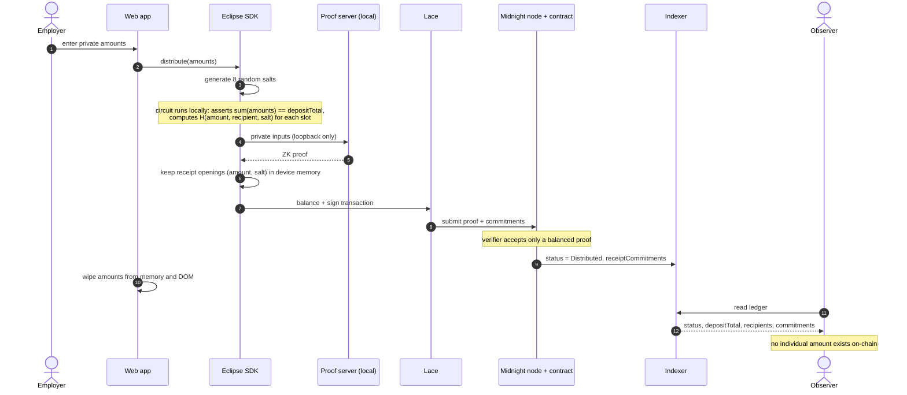
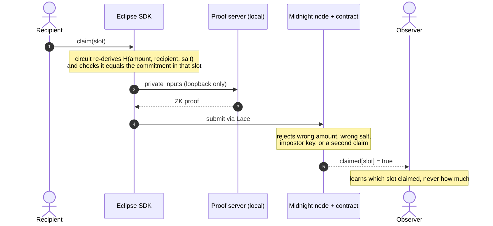

<div align="center">

# 🌘 Eclipse

**Private payroll on [Midnight](https://midnight.network). The books are public. The salaries are not.**

[](https://github.com/TadeyRuk/Eclipse/actions/workflows/ci.yml)
[](https://eclipse-private-payroll.netlify.app)
[](https://explorer.1am.xyz/contract/c3c8b06a7a6fe153b299dc2a6285bb4874615bd54d4614ba274a71b2899bdfac?network=preprod)
[](docs/evidence/l3-tests.png)
[](#license)

[**Live demo**](https://eclipse-private-payroll.netlify.app) · [**On-chain proof**](docs/evidence/l3-onchain-lifecycle.json) · [**Privacy model**](docs/privacy-model.md) · [**Architecture**](docs/architecture.md)

</div>

An employer deposits a fixed pool of tokens and splits it across up to eight recipients. Each
recipient's amount stays private, yet anyone can verify that the hidden amounts sum **exactly** to
the public deposit. A zero-knowledge circuit enforces that sum on-chain, so recipients trust the
math instead of the employer.

Salary confidentiality is a workplace norm almost everywhere; public blockchains break it by
default. Encryption would hide the numbers but prove nothing. Eclipse hides the numbers **and**
proves the payroll balances.

Built for Rise In's [New Moon to Full: Monthly Moonshots on Midnight](https://www.risein.com/programs/new-moon-to-full-monthly-moonshots-on-midnight)
program, Level 3 idea #6, _Private Payroll / Splits_.

<p align="center">
  
  <br>
  <sub>The observer view of a real Preprod payroll: distributed, balanced, slot 0 claimed, and no amount anywhere.</sub>
</p>

## Status

**Level 3 (First Quarter), in progress.** Everything below is verified on Preprod or in CI.

|                           |                                                                                                                            |
| ------------------------- | -------------------------------------------------------------------------------------------------------------------------- |
| ✅ Four circuits on-chain | `createPayroll` → `fund` → `distribute` → `claim` confirmed on Preprod ([tx ids](docs/evidence/l3-onchain-lifecycle.json)) |
| ✅ Real token deposit     | `fund` moves real unshielded tNIGHT into the contract                                                                      |
| ✅ Live demo              | Reads the Preprod ledger; Lace connects on Midnight Preprod                                                                |
| ✅ Tests + CI             | 53 tests; CI checks types, tests, build, circuit drift, and privacy docs on every push                                     |
| ✅ Proposal               | Idea #6 submitted on Rise In, awaiting committee approval ([proposal](docs/proposal.md))                                   |
| ⏳ Remaining              | One-minute demo recorded against Lace on Preprod; Level 3 filing                                                           |

<details id="progress-gantt">
<summary><b>Progress (Gantt)</b></summary>


```mermaid
gantt
    title Eclipse — Rise In New Moon to Full
    dateFormat YYYY-MM-DD
    axisFormat %b %d
    todayMarker off

    section Foundation
    Architecture and privacy docs     :done,    arch, 2026-07-19, 1d
    Gate0 sum-proof circuit plus tests :done,   g0,   2026-07-19, 1d

    section Level1_NewMoon
    createPayroll and stub fund       :done,    l1a, 2026-07-20, 1d
    Preprod deploy and screenshots    :done,    l1b, 2026-07-20, 1d
    File Level1 on Rise In            :done,    l1c, 2026-07-20, 1d

    section Level2_WaxingCrescent
    Lace SDK dual-view UI             :done,    l2a, 2026-07-20, 1d
    Live demo and demo video          :done,    l2b, 2026-07-20, 1d
    File Level2 on Rise In            :active,  l2c, 2026-07-20, 1d

    section Level3_FirstQuarter
    CI pipeline and badge             :done,    l3a, 2026-07-26, 1d
    Product proposal idea 6           :done,    l3b, 2026-07-26, 1d
    tNIGHT fund and claim             :done,    l3c, 2026-07-27, 3d
    Preprod redeploy and lifecycle    :done,    l3f, 2026-09-23, 4d
    One minute demo video             :active,  l3d, 2026-09-26, 1d
    File Level3 on Rise In            :crit,    l3e, 2026-07-31, 1d
```

Sequencing rules: [docs/boundaries.md](docs/boundaries.md). Level playbooks: [docs/submission.md](docs/submission.md).

</details>

## How it works

One contract instance is one payroll run. It moves through four circuits; each leaves a public
trace on the ledger while the amounts stay behind the proof.


```mermaid
stateDiagram-v2
    direction LR
    [*] --> Uninitialized: deploy
    Uninitialized --> Created: createPayroll(recipients)
    Created --> Funded: fund(amount) + tNIGHT deposit
    Funded --> Distributed: distribute(amounts, salts)
    Distributed --> Distributed: claim(slot) per recipient

    note right of Funded
        depositTotal is now public
    end note
    note right of Distributed
        proof enforced sum(amounts) == depositTotal
        only commitments were written
    end note
```

| Circuit         | Caller    | Private witnesses        | Becomes public                                                 |
| --------------- | --------- | ------------------------ | -------------------------------------------------------------- |
| `createPayroll` | Employer  | —                        | `employer`, `recipients`, `status = Created`                   |
| `fund`          | Employer  | —                        | `depositTotal`, `status = Funded`, the unshielded tNIGHT input |
| `distribute`    | Employer  | `amounts[8]`, `salts[8]` | 8 `receiptCommitments`, `status = Distributed`                 |
| `claim`         | Recipient | `amount`, `salt`         | `claimed[slot] = true`                                         |

There is no withdrawal, top-up, or re-distribute circuit. The absence of that code is the control.

## Architecture

Circuits execute **locally**: private inputs go only to a proof server on the user's own machine,
and only proofs and signed transactions reach the network. The web app never imports Midnight.js;
everything crosses one SDK whose ports return a typed `Result` and whose adapters are the only files
that touch Lace or Midnight.js. Full design: [docs/architecture.md](docs/architecture.md).


```mermaid
flowchart LR
    U(["👤 Employer / recipient"])

    subgraph device["🖥️ User's device · private"]
        UI["<b>apps/web</b><br/>React UI"]
        SDK["<b>packages/sdk</b><br/>ports → adapters"]
        PS["<b>Proof server</b><br/>127.0.0.1:6300"]
        LACE["<b>Lace</b><br/>wallet"]
    end

    subgraph chain["🌐 Midnight Preprod · public"]
        NODE["<b>Eclipse contract</b><br/>verifier + ledger"]
        IX["<b>Indexer</b><br/>GraphQL"]
    end

    U --> UI -->|"typed Result"| SDK
    SDK -->|"private witnesses"| PS
    PS -.->|"ZK proof"| SDK
    SDK -->|"proof + unsigned tx"| LACE
    LACE -->|"signed tx"| NODE
    NODE --> IX
    IX -.->|"public ledger state"| SDK
```

| Package                               | Role                                                                                                            |
| ------------------------------------- | --------------------------------------------------------------------------------------------------------------- |
| [`contracts/`](contracts)             | Compact contract (`src/eclipse.compact`), compiled circuits and keys (`managed/`), deploy and lifecycle scripts |
| [`packages/sdk/`](packages/sdk)       | The only layer that touches Midnight.js or the wallet: ports, adapters, `Result` error taxonomy                 |
| [`apps/web/`](apps/web)               | Role-scoped React UI; codes against SDK ports only                                                              |
| [`packages/config/`](packages/config) | Shared strict `tsconfig` and prettier config                                                                    |

## Data flow

### Distribute: where the amounts go, and where they don't


```mermaid
sequenceDiagram
    autonumber
    actor E as Employer
    participant UI as Web app
    participant SDK as Eclipse SDK
    participant PS as Proof server (local)
    participant L as Lace
    participant N as Midnight node + contract
    participant IX as Indexer
    actor O as Observer

    E->>UI: enter private amounts
    UI->>SDK: distribute(amounts)
    SDK->>SDK: generate 8 random salts
    Note over SDK: circuit runs locally: asserts sum(amounts) == depositTotal,<br/>computes H(amount, recipient, salt) for each slot
    SDK->>PS: private inputs (loopback only)
    PS-->>SDK: ZK proof
    SDK->>SDK: keep receipt openings (amount, salt) in device memory
    SDK->>L: balance + sign transaction
    L->>N: submit proof + commitments
    Note over N: verifier accepts only a balanced proof
    N->>IX: status = Distributed, receiptCommitments
    UI->>UI: wipe amounts from memory and DOM
    O->>IX: read ledger
    IX-->>O: status, depositTotal, recipients, commitments
    Note over O: no individual amount exists on-chain
```

### Claim: proving entitlement without stating the amount


```mermaid
sequenceDiagram
    autonumber
    actor R as Recipient
    participant SDK as Eclipse SDK
    participant PS as Proof server (local)
    participant N as Midnight node + contract
    actor O as Observer

    R->>SDK: claim(slot)
    Note over SDK: circuit re-derives H(amount, recipient, salt)<br/>and checks it equals the commitment in that slot
    SDK->>PS: private inputs (loopback only)
    PS-->>SDK: ZK proof
    SDK->>N: submit via Lace
    Note over N: rejects wrong amount, wrong salt,<br/>impostor key, or a second claim
    N-->>O: claimed[slot] = true
    Note over O: learns which slot claimed, never how much
```

## Privacy model

The ledger holds only the facts that must be public for the payroll to be verifiable; everything
else is a private witness that never leaves the prover. Canonical disclosure ledger and trust
assumptions: [docs/privacy-model.md](docs/privacy-model.md).

| Public (ledger)                                         | Private (witnesses)                |
| ------------------------------------------------------- | ---------------------------------- |
| Employer, recipient addresses, `depositTotal`           | Per-recipient `amounts`            |
| `status` (`Created` → `Funded` → `Distributed`)         | Per-recipient `salts`              |
| `receiptCommitments` (opaque hashes), `claimed[]` flags | Anything not written to the ledger |

**Why ZK, not encryption:** encrypted amounts would hide the values but prove nothing, so an observer
could not tell an honest payroll from one where the employer kept half the pool. Because the sum
check runs inside the circuit, an unbalanced distribution cannot produce a valid proof.

**Honest limitations**, each weighed in [docs/privacy-model.md](docs/privacy-model.md):

- **Small N leaks by arithmetic.** With one recipient, their amount equals the public total; privacy is meaningful from three recipients up.
- **The deposit total and recipient list are public in v1.** Eclipse protects the split, not the spend or the membership.
- **Claim timing is public.** Observers see which slot claimed and when, never how much.
- **Receipt openings live on the device that ran `distribute`**, so a claim runs where those openings are.
- **`claim` proves entitlement but does not pay out yet.** The deposit stays in the contract; private pay-out is Level 4 ([decision log](docs/boundaries.md)).

## Deployed contracts

| Network                      | Address                                                                                                                                                                                  | Circuits                                       |
| ---------------------------- | ---------------------------------------------------------------------------------------------------------------------------------------------------------------------------------------- | ---------------------------------------------- |
| Preprod — live demo          | [`c5f76edd6ac17076b4fca57218c01fb5e88f9b66248c0bb665b5fc0ab2bb6774`](https://explorer.1am.xyz/contract/c5f76edd6ac17076b4fca57218c01fb5e88f9b66248c0bb665b5fc0ab2bb6774?network=preprod) | `createPayroll`, `fund`, `distribute`, `claim` |
| Preprod — lifecycle run      | [`c3c8b06a7a6fe153b299dc2a6285bb4874615bd54d4614ba274a71b2899bdfac`](https://explorer.1am.xyz/contract/c3c8b06a7a6fe153b299dc2a6285bb4874615bd54d4614ba274a71b2899bdfac?network=preprod) | `createPayroll`, `fund`, `distribute`, `claim` |
| Preprod — L1/L2 (historical) | [`3aec836e6c723531cb13803e63795d531117c73231fa7793372c504a8bfa3d47`](https://explorer.1am.xyz/contract/3aec836e6c723531cb13803e63795d531117c73231fa7793372c504a8bfa3d47?network=preprod) | `createPayroll`, stub `fund`, `distribute`     |

The live-demo instance starts `Uninitialized` and runs one payroll. The lifecycle instance was
driven through all four circuits by `npm run lifecycle` on 2026-09-26 and ends `Distributed` with
`depositTotal=100` and slot 0 claimed. The L1/L2 address predates `claim` and the real tNIGHT
`fund`, and stays only as filing evidence for those levels.

## Try the live demo

The hosted app reads the chain for anyone. Running a circuit also needs a wallet and a local proof
server, because proving is local by design.

1. Install [Lace](https://www.lace.io/). In **Settings → Network**, choose **Testnet**, then under **Midnight** choose **Preprod**. The Midnight setting is separate and defaults to Preview; the wrong one fails with `Network ID mismatch`.
2. Copy your unshielded address (`mn_addr_preprod1…`, under **Receive → Unshielded**) into the [Preprod faucet](https://faucet.preprod.midnight.network/).
3. In Lace, open the **D** button and designate your tNIGHT for DUST generation. Fees are paid in tDUST, so wait until the tank reads above 0.
4. Start the proof server:
   ```bash
   docker run -p 6300:6300 midnightntwrk/proof-server:8.1.0 midnight-proof-server -v
   ```
5. Open the [live demo](https://eclipse-private-payroll.netlify.app/employer), connect Lace, then create → deposit → distribute, and watch [`/observer`](https://eclipse-private-payroll.netlify.app/observer).

## Quick start

```bash
npm install                         # Node 22 (see .nvmrc)
npm test                            # 53 tests across contracts, SDK, web
npm run dev -w @eclipse/web         # http://127.0.0.1:5173 (VITE_USE_CHAIN=1 for Preprod)
```

The compiled circuits in `contracts/managed/` are committed, so none of the above needs the Compact
compiler or a proof server. Recompile with `cd contracts && npm run compile` (Compact CLI).

<details>
<summary><b>Deploy and run the full lifecycle on Preprod</b></summary>

```bash
cd contracts && MIDNIGHT_NETWORK=preprod npm run deploy              # deploy one instance
MIDNIGHT_NETWORK=preprod npm run lifecycle -w @eclipse/contracts      # create → fund → distribute → claim
```

A cold Preprod wallet sync takes hours. For an unattended run, the watchdog keeps the machine
awake, restarts the script if the sync index stops advancing, and resumes from the wallet
checkpoint and run progress kept in `contracts/.states/` (gitignored):

```bash
MIDNIGHT_NETWORK=preprod LIFECYCLE_DEPLOY=1 bash contracts/deploy/run-lifecycle-watchdog.sh lifecycle contracts/logs/watchdog
```

`LIFECYCLE_SPARES=N` also deploys N untouched instances for the Lace demo. Transport modes:
`VITE_USE_CHAIN=0` runs an in-memory ledger for fee-free privacy demos; `VITE_USE_CHAIN=1` calls the
deployed contract through Lace and the local proof server.

</details>

## Testing

```bash
npm test
```

| Workspace      | Tests | Covers                                                                                                                                                                           |
| -------------- | ----- | -------------------------------------------------------------------------------------------------------------------------------------------------------------------------------- |
| `contracts`    | 20    | Sum-proof rejections, exact tNIGHT deposit, lifecycle ordering, claim (wrong amount, wrong salt, impostor key, double claim all rejected), ledger exposes only documented fields |
| `@eclipse/sdk` | 17    | `Result` mapping, salts, proof-server loopback, mock-port adapters, receipt storage, claim path                                                                                  |
| `@eclipse/web` | 16    | Amounts wiped after distribute, claim never renders the amount, observer has no amount fields, UI primitives                                                                     |

[`ci.yml`](.github/workflows/ci.yml) runs on every push and pull request to `main`:

- **typecheck · test · build**, then `npm run check:privacy`, which fails if any `export ledger` field or `export circuit` is missing from [docs/privacy-model.md](docs/privacy-model.md).
- **compiled circuit matches source**: recompiles with the pinned Compact compiler (0.31.1) and fails if the committed `contracts/managed/` differs, so the circuits the tests exercise and the app serves are provably this source.

## Evidence

| Artifact                                                                                                                                                                                              | What it shows                                                                                                                                                                                     |
| ----------------------------------------------------------------------------------------------------------------------------------------------------------------------------------------------------- | ------------------------------------------------------------------------------------------------------------------------------------------------------------------------------------------------- |
| [l3-onchain-lifecycle.json](docs/evidence/l3-onchain-lifecycle.json)                                                                                                                                  | Tx ids for all four circuits on Preprod and the final ledger                                                                                                                                      |
| [l3-observer-onchain.png](docs/evidence/l3-observer-onchain.png)                                                                                                                                      | Observer view of that payroll, read live from Preprod                                                                                                                                             |
| [l3-tests.png](docs/evidence/l3-tests.png)                                                                                                                                                            | 53 passing tests                                                                                                                                                                                  |
| [l3-demo-app.mp4](docs/evidence/l3-demo-app.mp4)                                                                                                                                                      | 48 s capture of the real app running the full flow in **in-memory mode** with a demo wallet (labelled on screen); reproducible via [l3-demo-app.record.mjs](docs/evidence/l3-demo-app.record.mjs) |
| [l3-demo.mp4](docs/evidence/l3-demo.mp4)                                                                                                                                                              | Illustrated walkthrough of the same flow                                                                                                                                                          |
| [l2-demo.webm](docs/evidence/l2-demo.webm) · [l2-connect.png](docs/evidence/l2-connect.png) · [l2-distribute.png](docs/evidence/l2-distribute.png) · [l2-observer.png](docs/evidence/l2-observer.png) | Level 2: Lace connected on Preprod, dual-view UI                                                                                                                                                  |
| [l1-compile.png](docs/evidence/l1-compile.png) · [l1-deploy.png](docs/evidence/l1-deploy.png)                                                                                                         | Level 1: compile and first Preprod deploy                                                                                                                                                         |

## Documentation

| Doc                                            | Contents                                                         |
| ---------------------------------------------- | ---------------------------------------------------------------- |
| [docs/architecture.md](docs/architecture.md)   | System design: contract, SDK adapters, frontend, security, CI    |
| [docs/privacy-model.md](docs/privacy-model.md) | Who learns what; every public ledger write and its justification |
| [docs/boundaries.md](docs/boundaries.md)       | Scope, numeric guardrails, sequencing gates, decision log        |
| [docs/proposal.md](docs/proposal.md)           | Product proposal for idea #6                                     |
| [docs/submission.md](docs/submission.md)       | Rise In level playbooks and filing records                       |
| [docs/README.md](docs/README.md)               | Docs index                                                       |

## License

MIT
