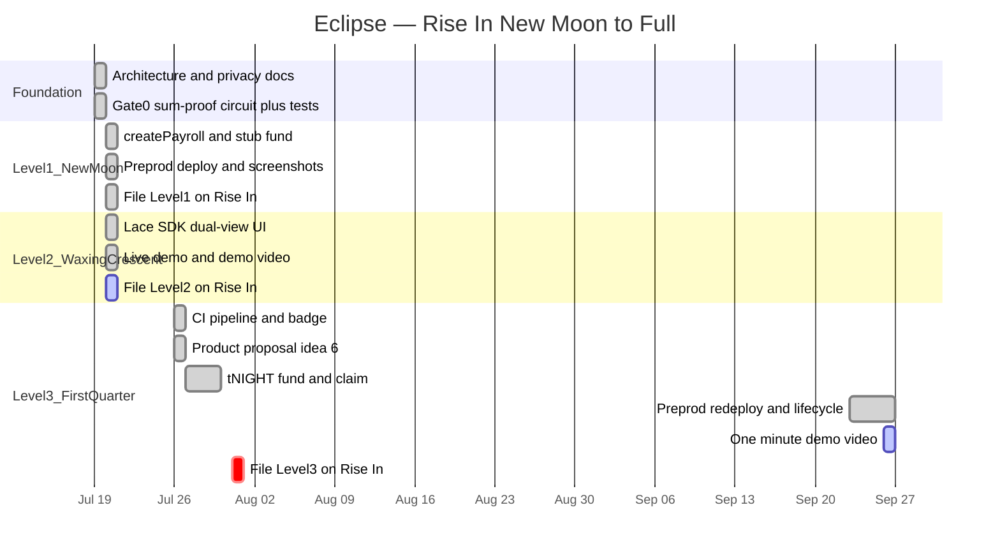

# Eclipse

[](https://github.com/TadeyRuk/Eclipse/actions/workflows/ci.yml)

Private payroll on [Midnight](https://midnight.network). An employer deposits a fixed pool of tokens and distributes it across a known set of recipients with individually private amounts — a zero-knowledge proof guarantees the hidden amounts sum exactly to the public deposit, so anyone can verify the books balance without anyone, including the chain itself, ever learning who received what.

Built for Rise In's [New Moon to Full: Monthly Moonshots on Midnight](https://www.risein.com/programs/new-moon-to-full-monthly-moonshots-on-midnight) program — Level 3 idea list, *Private Payroll / Splits*.

## Status

Level 2 Waxing Crescent **ready to file** — all requirements met: Lace connect/disconnect, a circuit
called from the frontend, observable privacy via the dual-view UI (employer wizard + observer
ledger), a verifiable Preprod contract, live demo, and demo video. SDK adapters sit behind a
`Result` boundary; privacy wipe tests cover the amount-clearing claim.

Level 3 First Quarter **in progress** — CI/CD is green (typecheck → test → build on every push), the
test suite stands at 53 across three workspaces, the `claim` circuit is live end to end (employee
claims a slot without revealing its amount), `fund` takes a real unshielded tNIGHT deposit (the
transaction only balances if the wallet moves the tokens), the product proposal for idea #6 is
submitted on Rise In and awaiting committee approval ([docs/proposal.md](docs/proposal.md)), and the
four-circuit contract is redeployed to Preprod with the full create → fund → distribute → claim
lifecycle confirmed on chain ([evidence](docs/evidence/l3-onchain-lifecycle.json)). Remaining: the
one-minute demo recorded against Lace on Preprod, and filing.

Running create → fund → distribute yourself needs a local proof-server on `127.0.0.1:6300` — circuits
prove locally by design, so this is inherent to Midnight, not a shortcut. Connect-only works on the
hosted demo without one.

**Last updated:** 2026-09-26 · Program window: 2026-06-29 → 2026-07-31

### Live demo

| Surface | URL |
|---|---|
| Employer wizard | [https://eclipse-private-payroll.netlify.app/employer](https://eclipse-private-payroll.netlify.app/employer) |
| Observer ledger | [https://eclipse-private-payroll.netlify.app/observer](https://eclipse-private-payroll.netlify.app/observer) |

Connect-only works on the hosted site without a proof-server. Create → fund → distribute needs Lace (Preprod) plus a local proof-server on `127.0.0.1:6300`.

### Contract address

| Network | Address | Circuits |
|---|---|---|
| Preview | — | — |
| Preprod — live demo | [`c5f76edd6ac17076b4fca57218c01fb5e88f9b66248c0bb665b5fc0ab2bb6774`](https://explorer.1am.xyz/contract/c5f76edd6ac17076b4fca57218c01fb5e88f9b66248c0bb665b5fc0ab2bb6774?network=preprod) | `createPayroll`, `fund`, `distribute`, `claim` |
| Preprod — lifecycle run | [`c3c8b06a7a6fe153b299dc2a6285bb4874615bd54d4614ba274a71b2899bdfac`](https://explorer.1am.xyz/contract/c3c8b06a7a6fe153b299dc2a6285bb4874615bd54d4614ba274a71b2899bdfac?network=preprod) | `createPayroll`, `fund`, `distribute`, `claim` |
| Preprod — L1/L2 (historical) | [`3aec836e6c723531cb13803e63795d531117c73231fa7793372c504a8bfa3d47`](https://explorer.1am.xyz/contract/3aec836e6c723531cb13803e63795d531117c73231fa7793372c504a8bfa3d47?network=preprod) | `createPayroll`, stub `fund`, `distribute` |

The live-demo instance starts `Uninitialized`, and one instance is one payroll run, so the hosted
employer flow can be taken through once. The lifecycle instance was driven through all four
circuits by `npm run lifecycle` on 2026-09-26 and ends `Distributed` with `depositTotal=100` and
slot 0 claimed; its transaction ids are in
[l3-onchain-lifecycle.json](docs/evidence/l3-onchain-lifecycle.json). The L1/L2 address predates
`claim` and the real tNIGHT `fund` and is kept only as filing evidence for those levels.

**Evidence:** [L1 compile](docs/evidence/l1-compile.png) · [L1 deploy](docs/evidence/l1-deploy.png) · [L2 connect](docs/evidence/l2-connect.png) · [L2 distribute](docs/evidence/l2-distribute.png) · [L2 observer](docs/evidence/l2-observer.png) · [L2 demo video](docs/evidence/l2-demo.webm) · [L2 storyboard](docs/evidence/l2-demo-storyboard.md) · [L3 tests (53 passing)](docs/evidence/l3-tests.png) · [L3 on-chain lifecycle](docs/evidence/l3-onchain-lifecycle.json) · [L3 observer on Preprod](docs/evidence/l3-observer-onchain.png) · [L3 storyboard](docs/evidence/l3-demo-storyboard.md) · [**L3 demo video (app capture)**](docs/evidence/l3-demo-app.mp4) · [L3 illustrated walkthrough](docs/evidence/l3-demo.mp4)

> **L3 demo video ([l3-demo-app.mp4](docs/evidence/l3-demo-app.mp4), 48 s)** is a real screen
> capture of this app running the full flow: connect → three recipients → deposit tNIGHT → private
> amounts → distribute → observer view → employee claim → observer shows slot 0 claimed, with no
> amount visible anywhere. It runs in **in-memory mode** (`VITE_USE_CHAIN=0`) with a demo wallet
> standing in for Lace, and says so in an on-screen banner: no Preprod transactions happen in it.
> The recording is scripted and reproducible:
> [`l3-demo-app.record.mjs`](docs/evidence/l3-demo-app.record.mjs).
> [l3-demo.mp4](docs/evidence/l3-demo.mp4) is an illustrated Remotion walkthrough of the same six
> beats. The L2 video is a real capture with Lace connected on Preprod.

### Progress (Gantt)


```mermaid
gantt
    title Eclipse — Rise In New Moon to Full
    dateFormat YYYY-MM-DD
    axisFormat %b %d
    todayMarker off

    section Foundation
    Architecture and privacy docs     :done,    arch, 2026-07-19, 1d
    Gate0 sum-proof circuit plus tests :done,   g0,   2026-07-19, 1d

    section Level1_NewMoon
    createPayroll and stub fund       :done,    l1a, 2026-07-20, 1d
    Preprod deploy and screenshots    :done,    l1b, 2026-07-20, 1d
    File Level1 on Rise In            :done,    l1c, 2026-07-20, 1d

    section Level2_WaxingCrescent
    Lace SDK dual-view UI             :done,    l2a, 2026-07-20, 1d
    Live demo and demo video          :done,    l2b, 2026-07-20, 1d
    File Level2 on Rise In            :active,  l2c, 2026-07-20, 1d

    section Level3_FirstQuarter
    CI pipeline and badge             :done,    l3a, 2026-07-26, 1d
    Product proposal idea 6           :done,    l3b, 2026-07-26, 1d
    tNIGHT fund and claim             :done,    l3c, 2026-07-27, 3d
    Preprod redeploy and lifecycle    :done,    l3f, 2026-09-23, 4d
    One minute demo video             :active,  l3d, 2026-09-26, 1d
    File Level3 on Rise In            :crit,    l3e, 2026-07-31, 1d
```

| Gate / level | State |
|---|---|
| Gate 0 — sum-proof spike | **Done** |
| Level 1 — New Moon | **Filed** (Rise In) |
| Level 2 — Waxing Crescent (Lace + dual-view) | **Ready to file** (Rise In) |
| Level 3 — First Quarter (full dApp + CI) | **In progress** — CI (+ circuit drift and privacy-doc checks), 53 tests, `claim`, tNIGHT `fund`, proposal submitted, four-circuit Preprod redeploy and on-chain lifecycle done; Lace/Preprod demo recording pending |

Sequencing rules: [docs/boundaries.md](docs/boundaries.md). Level filing playbooks: [docs/submission.md](docs/submission.md).

## Initial idea

Eclipse is a private payroll dApp on Midnight. An employer deposits a fixed pool of test tokens, assigns each recipient's share privately, and distributes in one atomic transaction. A zero-knowledge proof guarantees the hidden amounts sum exactly to the public deposit — so recipients and observers can trust the books balance without anyone (including the chain itself) ever seeing who earned what. Salary privacy is a real-world norm; Eclipse makes it a verifiable one.

## Privacy claim (L2)

Individual payroll amounts are **private witnesses**. Observers (and the chain) see employer, recipient addresses, `depositTotal`, `status`, and opaque `receiptCommitments` — never plaintext per-recipient amounts. The employer UI clears amounts from memory and the DOM after a successful distribute; the `/observer` route has no amount inputs. Disclosure ledger: [docs/privacy-model.md](docs/privacy-model.md).

## Public state vs private witness

In Compact, circuit inputs are **private by default**. Data becomes public when it is written to the ledger (or returned / passed cross-contract) — not merely because `disclose()` appears in source.

| Public (ledger) | Private (witnesses) |
|---|---|
| Employer, recipient addresses, `depositTotal` | Per-recipient `amounts` |
| `status` (`Created` → `Funded` → `Distributed`) | Per-recipient `salts` |
| `receiptCommitments` (opaque hashes) | Anything not written to ledger |

`distribute()` asserts `sum(amounts) == depositTotal` without putting individual amounts on-chain.

## Quick Start

```bash
# Node 22 (see .nvmrc)
npm install

# Compile the Compact contract (requires Compact CLI)
cd contracts && npm run compile

# Contract + SDK + web privacy tests
npm test
```

### Web UI (local)

```bash
# Terminal A — proof server (required for create/fund/distribute); pin to ledger 8.1.0
docker run -p 6300:6300 midnightntwrk/proof-server:8.1.0 midnight-proof-server -v

# Terminal B — dual-view app (add VITE_USE_CHAIN=1 for real Preprod callTx)
npm run dev -w @eclipse/web
# open http://127.0.0.1:5173/employer and /observer
```

Needs Lace (Preprod) + funded tDUST for a real wallet connect. Connect-only works without the proof-server; circuits call `ProofClient.healthCheck()` first and fail closed if `:6300` is down.

### Deploy contract (Preprod)

```bash
cd contracts && MIDNIGHT_NETWORK=preprod npm run deploy
```

On-chain create→fund→distribute→claim (same Midnight.js path as the UI, deploy wallet):

```bash
MIDNIGHT_NETWORK=preprod npm run lifecycle -w @eclipse/contracts
```

A cold Preprod wallet sync takes hours. For an unattended run, use the watchdog: it keeps the
machine awake, restarts the script if the sync index stops advancing, and each restart resumes from
the wallet checkpoint and run progress kept in `contracts/.states/` (gitignored):

```bash
MIDNIGHT_NETWORK=preprod LIFECYCLE_DEPLOY=1 bash contracts/deploy/run-lifecycle-watchdog.sh lifecycle contracts/logs/watchdog
```

## Live demo prerequisites

Judges on Netlify **cannot** use your laptop’s proof-server unless they run one locally.

1. Install [Lace](https://www.lace.io/) and switch to **Preprod**
2. Fund tDUST via the Midnight faucet (and ensure Night is registered for dust generation)
3. Run the proof-server on loopback:

```bash
docker run -p 6300:6300 midnightntwrk/proof-server:8.1.0 midnight-proof-server -v
```

4. Open the live demo → Connect Lace → Employer create → deposit tNIGHT → distribute (`VITE_USE_CHAIN=1` on Netlify)
5. Open `/observer`: public status + commitments; **no** private amounts

Transport modes:

- **`VITE_USE_CHAIN=0`:** in-memory ledger for dual-view privacy demos without fees
- **`VITE_USE_CHAIN=1`:** Midnight.js `findDeployedContract` + `callTx` via Lace + local proof-server **8.1.0**; observer reads the Preprod indexer

## Architecture

Monorepo: `apps/web` → `packages/sdk` → Lace / proof-server. The web app never imports Midnight.js. SDK ports (`WalletPort`, `EclipsePort`) return typed `Result`; adapters (`LaceAdapter`, `MidnightAdapter`, `ProofClient`) are the only external-touch files.

Details: [docs/architecture.md](docs/architecture.md). Scope gates: [docs/boundaries.md](docs/boundaries.md).

## Privacy Model

### What an observer can learn

Anyone querying the chain sees the employer address, the full recipient list, the `depositTotal`, the
lifecycle `status`, and eight opaque `receiptCommitments`. When `status = Distributed`, they also
learn something stronger: that the distribution **provably balanced** — the hidden amounts sum
exactly to the public deposit.

### What an observer cannot learn

No chain query by anyone — including the employer — returns an individual amount. Per-recipient
`amounts` and `salts` are private witnesses; they never become ledger state. The commitments are
hashes, opaque without the opening a recipient holds.

| Fact | Employer | Recipient (self) | Recipient (others) | Observer |
|---|---|---|---|---|
| Payroll exists, employer address | ✅ | ✅ | ✅ | ✅ |
| Deposit total | ✅ | ✅ | ✅ | ✅ |
| Recipient list | ✅ | ✅ | ✅ | ✅ |
| Distribution balanced (proven) | ✅ | ✅ | ✅ | ✅ |
| Which slots have claimed | ✅ | ✅ | ✅ | ✅ |
| Own amount | ✅ | ✅ | — | ❌ |
| **Any individual amount from chain data** | ❌ | ❌ | ❌ | ❌ |

### Why this needs ZK rather than encryption

Posting encrypted amounts would hide the values but prove nothing — an observer could not distinguish
an honest payroll from one whose numbers don't add up, or where the employer kept half the pool.
Because the sum check runs *inside* the circuit, an unbalanced distribution cannot produce a valid
proof, so it cannot be confirmed. Recipients trust the math, not the employer.

### Honest limitations

- **Small-N inference.** With one recipient, their amount equals the public total; with two, each can
  infer the other's. Amount privacy is meaningful from N=3 upward — a property of the arithmetic, not
  a defect in the circuit.
- **Claim timing is public.** `claimed[]` is a per-slot flag, so observers learn which recipient
  claimed and when — never how much. A nullifier-set design would hide the slot too; it was weighed
  and deferred, since the amount-privacy claim does not depend on it.
- **The deposit total is public by design.** Observers learn the company distributed 1000 tokens.
  What is protected is the split, not the spend.
- **The recipient list is public in v1.** Observers learn *who* was paid, not *how much*. Hiding
  membership is a possible v2, out of scope per [docs/boundaries.md](docs/boundaries.md).
- **Off-chain leakage is out of scope.** If the employer emails a spreadsheet, no chain helps.

Full disclosure ledger and trust assumptions: [docs/privacy-model.md](docs/privacy-model.md).

## Testing

```bash
npm test
```

53 tests across three workspaces:

- **contracts** — 20 tests: sum-proof (sum above or below the deposit rejected, value on an unused
  slot rejected), fund (requires an unshielded native-token deposit of exactly the amount; rejected
  before create or when already funded), lifecycle ordering, claim (valid opening; wrong amount,
  wrong salt, impostor key, out-of-range slot, double claim and claim-before-distribute all
  rejected), and ledger privacy (the ledger exposes exactly the documented public fields; salted
  commitments differ for equal amounts)
- **@eclipse/sdk** — 17 tests: Result mapping, salts, ProofClient loopback, mock-port adapters,
  receipt-opening storage and the claim path
- **@eclipse/web** — 16 tests: amount wipe after distribute, employee claims without rendering the
  amount, observer has no private amount fields, `MAX_RECIPIENTS` validation (6 privacy tests), plus
  10 render/prop tests for the Card/Tag/Button/Pill/StatChip/GradientField UI primitives

### CI

[`.github/workflows/ci.yml`](.github/workflows/ci.yml) runs on every push and pull request to
`main`, as two jobs:

- **typecheck · test · build**, then `npm run check:privacy`: every `export ledger` field and every
  `export circuit` in the contract must appear in [docs/privacy-model.md](docs/privacy-model.md), so
  a new public fact cannot ship without a disclosure row.
- **compiled circuit matches source**: installs the pinned Compact compiler (0.31.1), recompiles,
  and fails if the committed `contracts/managed/` (circuit JS, prover/verifier keys, zkir) differs.
  The artifacts the tests exercise and the app serves are provably this source.

Because `managed/` is committed, the test job needs neither the compiler nor a proof server.

## Documentation

| Doc | Contents |
|---|---|
| [docs/README.md](docs/README.md) | Docs index |
| [docs/proposal.md](docs/proposal.md) | Product proposal — idea #6, Private Payroll / Splits |
| [docs/submission.md](docs/submission.md) | Rise In submission playbook |
| [docs/architecture.md](docs/architecture.md) | System design |
| [docs/privacy-model.md](docs/privacy-model.md) | Who learns what |
| [docs/boundaries.md](docs/boundaries.md) | Scope and gates |

## License

MIT
